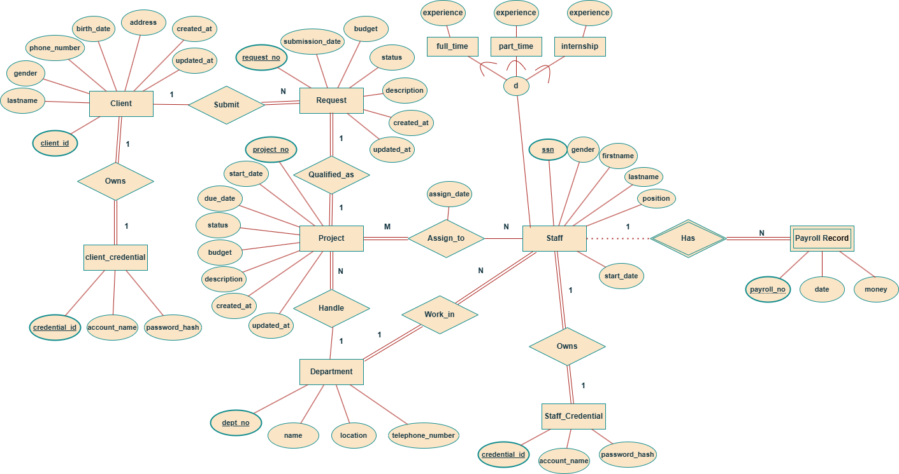
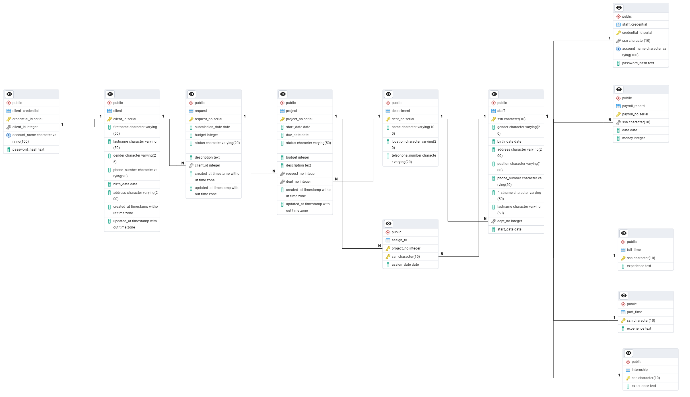
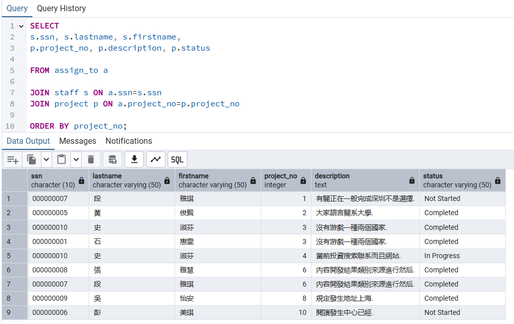

# Ad Submission System

## Project Overview
Ad Submission System is a web-based marketing platform for managing advertisement submissions. It allows clients to submit new advertising project requests and enables staff to review, manage, and approve those requests. The goal is to streamline the ad submission process from the client proposal stage to project assignment and completion. This platform is built with Flask (a Python web framework) for the web application, PostgreSQL for the relational database, and Docker (via Docker Compose) for containerized deployment. With this stack, the application offers a robust backend with a user-friendly front-end interface, all easily deployable in any environment.

## Features

- **Client Registration & Login**: Clients can create an account and log in to their dashboard. Upon registration, client details are stored securely (with plans for password hashing for security).
  
- **Ad Request Submission**: Logged-in clients can submit a new ad request by providing details like budget and a description of the advertisement project. Each request is saved with a status (e.g., Pending, Approved, Rejected) and timestamp.
  
- **Staff Login & Dashboard**: Staff members have a separate login and dashboard. On the staff dashboard, they can view all client requests along with details (submission date, budget, description, status) and update the status of each request. This allows the marketing team to approve or reject pending requests.
  
- **Project Assignments**: Once a request is approved by staff, it becomes an active project. Staff can see the projects assigned to them (filtered by their user account), so each staff member knows which advertising projects they are responsible for. This feature ensures that staff only see and manage their own assignments.
  
- **SQL Queries**: The system’s database is designed not only for transaction processing but also for analysis. A set of SQL queries is included to demonstrate analytical capabilities on the data – for example, calculating average budgets, grouping clients by age, ranking staff by project count, etc. (See the SQL Analysis Showcase below for examples and screenshots of these queries in action.)

## Folder Structure Overview
The repository is organized into folders and files to separate concerns and make it easy to navigate:

- **Application Code & Modules**: All Flask application code (routes, models, etc.) is organized in a module (for example, in an ```app/``` directory or similar structure). This includes the main application factory or initialization code.
  
- **Templates** (```/templates/```): Contains the HTML template files for the web interface. For instance, ```client_dashboard.html```, ```staff_dashboard.html```, ```client_login.html```, ```staff_login.html```, ```register.html```, ```submit_request.html```, etc., are all stored here. These templates are rendered by Flask to generate the pages that clients and staff see.

- **Data Generator** (```/generator/```): Includes scripts for generating sample data. The ```generate_sample_data.py``` script stays here, creates SQL insert statements to populate the database with example clients, staff, requests, projects, etc based on our table schema. 
  
- **SQL Analysis** (```/sql/```): Contains screenshots of SQL commands and the result used in this README’s SQL Analysis Showcase section.
  
- **Docker Configuration**: The root of the project contains the ```docker-compose.yml``` file and a Dockerfile for the Flask app. The Docker Compose file defines how the containers (app, PostgreSQL, pgAdmin) work together, including port mappings (5000 for the app, 5432 for Postgres, 5050 for pgAdmin) and volumes (to persist database data or to load the initial SQL scripts into the database container).

- **Miscellaneous**: Standard files like ```requirements.txt``` (listing Python dependencies), and .gitignore are present at the root. The ```requirements.txt``` is used to install the necessary Python packages inside the Docker image (Flask, psycopg2 for PostgreSQL connection, etc.).

### Sample Data Generation
To avoid manual insertion of values across 12 tables, I generated the `sample_data.sql` using `generate_sample_data.py`. It used `faker` library to simulate real data for us to do easy analysis.

Steps taken:
1. Defined lists of sample records for each table (e.g. staff, client).
2. Used Python to loop through and construct SQL insert statements.
3. Ensured foreign key relationships were respected.
4. Saved the final result into a single SQL script: `sql/sample_data/sample_data.sql`.

This method supports fast reloading, modification, and reproducibility.

## Diagram Design

### Entity-Relationship Diagram (ERD)


### ERD to Relational Mapping Table

| Relationship | Relation Between Entities | Relational Cardinality | Participation Cardinality |
|---|---|---|---|
| Has (Weak) | Staff – Payroll Record | 1 → N | Staff (P) – Payroll Record (T) |
| Work_in | Department – Staff | 1 → N | Department (P) – Staff (T) |
| Handle | Department – Project | 1 → N | Department (P) – Project (T) |
| Assign_to | Project – Staff | M → N | Project (T) – Staff (P) |
| Qualified_as | Request – Project | 1 → 1 | Request (T) – Project (T) |
| Submit | Client – Request | 1 → N | Client (P) – Request (T) |
| Owns | Staff – Staff_Credential | 1 → 1 | Staff (T) – Staff_Credential (T) |
| Owns | Client – Client_Credential | 1 → 1 | Client (T) – Client_Credential (T) |


### Formal Relational Schema


### Functional Dependencies

**Staff**

- SSN → Gender, Birth date, Address, Phone number, Firstname, Lastname, Position, Dept_no, Start_date

**Full time / Part time / Internship**

- SSN → Experience

**Client**

- Client_ID → Firstname, Lastname, Gender, Phone number, Birth date, Address

**Department**

- Dept_No → Name, Location, Telephone number

**Request**

- Request_No → Submission date, Budget, Status, Description, Client_ID, Created_at, Updated_at

**Project**

- Project_No → Start_date, Due_date, Status, Budget, Description, Request_No, Dept_No, Created_at, Updated_at

**Payroll Record**

- Payroll_No → SSN, Date, Money

**Assign_to**

- (Project_No, SSN) → Assign_date

**Staff_Credential**
- credential_id → ssn, account_name, password_hash

**Client_Credential**
- credential_id → client_id, account_name, password_hash


### BCNF Normalization check

| Table           | Primary Key / Candidate Key   | BCNF Satisfied? | Reason                                                                 |
|----------------|-------------------------------|-----------------|------------------------------------------------------------------------|
| staff          | ssn                            | Yes             | All non-key attributes fully depend on the superkey `ssn`              |
| client         | client_id                      | Yes             | `client_id` is the only determinant                                    |
| department     | dept_no                        | Yes             | Single key dependency with no transitive or partial issues             |
| project        | project_no                     | Yes             | No attribute is dependent on anything other than the superkey          |
| request        | request_no                     | Yes             | All non-key attributes directly depend on `request_no`                 |
| assign_to      | (project_no, ssn)              | Yes             | Composite key; assign_date depends on both keys                        |
| staff_credential | credential_id               | Yes            | All fields depend directly on PK   |
| client_credential| credential_id               | Yes            | All fields depend directly on PK   |
| payroll_record | payroll_no                     | Yes             | All fields depend on `payroll_no`, the primary key                     |
| full_time      | ssn                            | Yes             | Direct 1-to-1 mapping; fully dependent on primary key                  |
| part_time      | ssn                            | Yes             | Same as full_time                                                      |
| internship     | ssn                            | Yes             | Same as full_time     


### Data Dictionary

| Table Name | Column Name | Data Type | Description |
|---|---|---|---|
| department | dept_no | SERIAL (PK) | Unique department ID |
|  | name | VARCHAR(100) | Name of the department |
|  | location | VARCHAR(20) | Department location (e.g., floor, building) |
|  | telephone_number | VARCHAR(20) | Contact number for the department |
| staff | ssn | CHAR(10) (PK) | Social Security Number (identifier) |
|  | gender | VARCHAR(20) | Gender identity |
|  | birth_date | DATE | Date of birth |
|  | address | VARCHAR(200) | Home or mailing address |
|  | phone_number | VARCHAR(20) | Contact number (unique) |
|  | firstname | VARCHAR(50) | First name of the staff member |
|  | lastname | VARCHAR(50) | Last name of the staff member |
|  | position | VARCHAR(100) | the title of the staff member |
|  | dept_no | INTEGER (FK) | Linked department ID |
|  | start_date | DATE | Employment start date |
| full_time | ssn | CHAR(10) (PK/FK) | Reference to full-time staff SSN |
|  | experience | TEXT | Description of experience |
| part_time | ssn | CHAR(10) (PK/FK) | Reference to part-time staff SSN |
|  | experience | TEXT | Description of experience |
| internship | ssn | CHAR(10) (PK/FK) | Reference to intern staff SSN |
|  | experience | TEXT | Description of experience |
| client | client_id | SERIAL (PK) | Unique client ID |
|  | firstname | VARCHAR(50) | First name |
|  | lastname | VARCHAR(50) | Last name |
|  | gender | VARCHAR(25) | Gender identity |
|  | phone_number | VARCHAR(20) | Contact number |
|  | birth_date | DATE | Date of birth |
|  | address | VARCHAR(200) | Residential address |
|  | created_at | TIMESTAMP | Timestamp when record was created |
|  | updated_at | TIMESTAMP | Timestamp when record was last updated |
| request | request_no | SERIAL (PK) | Unique ID for each request |
|  | submission_date | DATE | When the request was submitted |
|  | budget | INTEGER | Budget amount for the request |
|  | status | VARCHAR(20) | Status of the request (e.g., Pending) |
|  | description | TEXT | Description of the request |
|  | client_id | INTEGER (FK) | Linked client ID |
|  | created_at | TIMESTAMP | Record creation timestamp |
|  | updated_at | TIMESTAMP | Last update timestamp |
| project | project_no | SERIAL (PK) | Unique ID for each project |
|  | start_date | DATE | Project kickoff date |
|  | due_date | DATE | Project deadline |
|  | status | VARCHAR(50) | Project current status |
|  | budget | INTEGER | Allocated project budget |
|  | description | TEXT | Description of the project |
|  | request_no | INTEGER (FK) | Related request number |
|  | dept_no | INTEGER (FK) | Department handling the project |
|  | created_at | TIMESTAMP | When the project record was created |
|  | updated_at | TIMESTAMP | When the project was last updated |
| assign_to | project_no | INTEGER (PK/FK) | Assigned project number |
|  | ssn | CHAR(10) (PK/FK) | Staff SSN assigned to project |
|  | assign_date | DATE | Date of assignment |
| payroll_record | payroll_no | SERIAL (PK) | Unique payroll ID |
|  | ssn | CHAR(10) (FK) | Linked staff SSN |
|  | date | DATE | Date of payroll record |
|  | money | INTEGER | Salary amount |
| staff_credential   | credential_id    | SERIAL (PK)    | Unique login credential ID for staff     |
|                    | ssn              | CHAR(10) (FK)  | Associated staff SSN                     |
|                    | account_name     | VARCHAR(100)   | Staff login name                         |
|                    | password_hash    | TEXT           | Secure hashed password                   |
| client_credential  | credential_id    | SERIAL (PK)    | Unique login credential ID for client    |
|                    | client_id        | INTEGER (FK)   | Associated client ID                     |
|                    | account_name     | VARCHAR(100)   | Client login name                        |
|                    | password_hash    | TEXT           | Secure hashed password                   |

## Setup Instruction
Follow these steps to set up and run the Ad Submission System on your local machine:

1. **Prerequisites**: Make sure you have **Git**, **Docker**, and **Docker Compose** installed on your system.
  
2. **Clone the Repository**: Clone this repository to your local machine using Git.
```
git clone https://github.com/TsungTseTu122/ad-submission-system-postgres.git
```
Then navigate into the project directory:
```
cd ad-submission-system-postgres
```

3. **Generate sample data** (optional if you have your own data):
```
python generator/generate_sample_data.py
```
This will create a SQL file with sample data (02_sample_data.sql) that will be used to populate the database. Feel free to twitch some settings to either generate more data or change schema on personal need.

4. **Build and start container**:
Docker will set up multiple containers for the system – typically including the Flask web app, the PostgreSQL database, and a pgAdmin service for database administration. The first time you run this, it will download required base images and set up the environment.

5. **Access the web application**:
Once the containers are up and running, open your browser and navigate to `http://localhost:5000`. You should see the Ad Submission System’s web interface, which is the client login by default. From here, you can register a new client account or use existing sample credentials to log in as a client or staff (depending on the sample data you loaded).

6. **Access pgAdmin (Database UI)**: pgAdmin (a web-based PostgreSQL admin tool) is optionally provided for convenience. If included in the Docker setup, you can access it at `http://localhost:5050`. Log in with the email and password configured in the Docker Compose file (default admin should be admin@admin.com / admin111). Once logged in, you can inspect the database schema, tables, and run queries (the sample analytical queries can be executed here to verify the results).

After these steps, you will have the Flask app running (serving the client and staff dashboards) and the database initialized with the required schema. You can then interact with the system as a client or staff to test all features. Further demonstration would be shown on the next part.

## Project Demo
Below are screenshots demonstrating key parts of the system’s user interface. These screenshots illustrate how clients and staff interact with the platform:

## SQL Analysis Showcase
In addition to the web application features, the project includes a series of SQL queries that showcase the analytical insights one can extract from the data. These queries were designed to demonstrate complex SQL operations such as joins, aggregations, filtering with conditions, and window functions (I set a random state in the generator code, so the result should be the same if you used it). Below is a list of example queries performed on the database, along with brief descriptions and a screenshot of the query results:

- **Average Budgets by Department**: Calculates the average budget of client requests versus the average project budget for each department, and counts the total number of projects in that department. This helps compare the initial requested budget from clients to the actual budget of projects handled by each department.
  


- **Client Request Status Counts**: Shows each client’s total number of requests broken down by status (Approved, Pending, Rejected). This query uses filtered aggregate counts to provide insight into how many requests from each client have been approved, rejected or are still pending. It’s useful for understanding client engagement and success rates of their submissions.
  


-  **Staff Project Count Rank (by Department)**: Ranks staff members within each department by the number of projects they are assigned to. This query uses a window function (`RANK() OVER (PARTITION BY dept_no ORDER BY project_count DESC)`) to assign a rank to each staff member per department based on their project count. It highlights the distribution of workload among staff in the same department.
  


- **Client Age Group Categorization**:
The query calculates each client’s age (based on birth date) and then categorizes them into groups (Under 20, 20s, 30s, 40s, 50+). This demonstrates how to perform data transformation in SQL using CASE expressions.


- **Overall Staff Project Ranking**:
Determines the ranking of staff by total number of projects across the entire organization. Unlike the department-specific ranking, this query ranks all staff globally by project count to find who has worked on the most projects overall.


- **Project Assignments (Join Example)**:
An example of a multi-table join that lists all project assignments. It combines data from the assignment table, staff table, and project table to show which staff member (name and ID) is assigned to which project, along with the project’s status and description. This showcases a basic yet crucial use of SQL JOINs to pull together related information.


